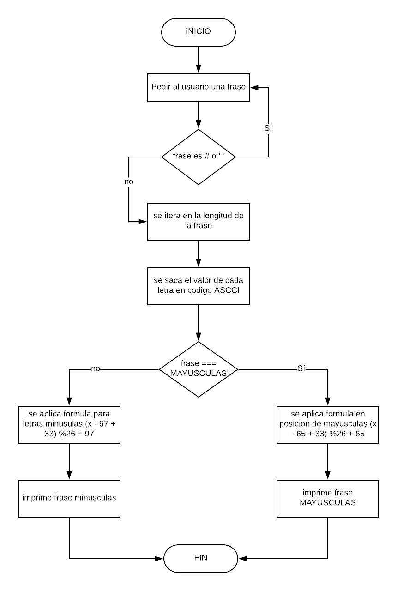

# DESCRIPCION #

CREAR UNA WEB QUE PIDA POR MEDIO DE UN PROMPT UNA FRASE Y DEVUELVA EL MESAJE ENCRIPTADO, SEGUN EL CIFRADO CESAR, CON UN PARAMETRO DE DESPLAZAMIENTO DE 33 ESPACIOS HACIA LA DERECHA.

 # PSEUDOCODIGO

 1. CREAR UN ARCHIVO HTML Y JS Y ENLAZARLO.
 2. CREAR DOS FUNCIONES CIPHER Y DECHIPER.
 3. PEDIR AL USUARIO QUE INGRESE LA FRASE.
 4. NO SE PODRA INGRESAR NUMEROS NI ESPACIOS.
 5. DEBE IDENTICAR ENTRE MAYUSCULAS Y MINUSCULAS.
 6. IMPRIMIR LA FRASE ENCRIPTADA O DESENCRIPTADA EN LA WEB.

 # DIAGRAMA DE FLUJO

